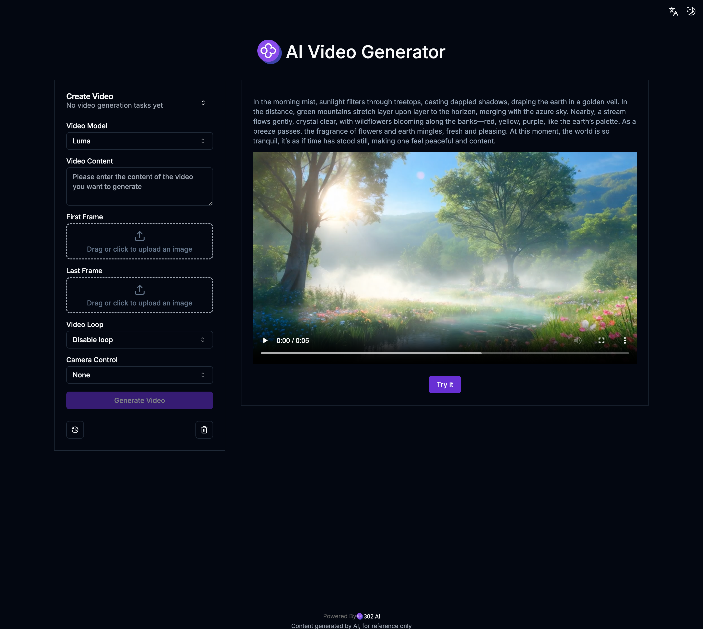

# 🎬🤖 Welcome to 302.AI's AI Tools! 🚀✨

[Chinese](README_zh.md) | [English](README.md) | [Japanese](README_ja.md)

## ✨ Introduction to 302.AI ✨

[302.AI](https://302.ai) is a pay-as-you-go AI application platform that solves the last mile problem of applying AI to practice for users.

1. 🧠 It brings together the latest and most comprehensive AI capabilities and brands, including but not limited to language models, image models, voice models, and video models.
2. 🚀 Conducts in-depth application development on foundational models to create real AI products, not just simple chatbots.
3. 💰 Zero monthly fee; all features are pay-as-you-go, fully open, achieving truly low entry barriers and high ceilings.
4. 🛠 A powerful management backend for teams and small to medium-sized businesses, allowing for single-person management and multi-person use.
5. 🔗 All AI capabilities provide API access, and all tools are open-source and customizable (ongoing).
6. 💡 A strong development team launches 2-3 new applications per week, with daily product updates. Interested developers are also welcome to contact us.

## Project Features

1. 🎥 **AI Video Generator**: Supports various image-to-video generation models for quickly creating custom videos.

## Tech Stack

- Next.js 14 as the base framework
- Tailwind CSS + ShadcnUI for style components
- Zod + React-Hook-Form for form handling
- Zustand for data management
- React Query for request management

## Development & Deployment

1. Run the project `pnpm dev`
2. Build and deploy `docker build -t 302-ai-tool . && docker run -p 3000:3000 302-ai-tool`

## Interface Preview

### 1. AI Video Generator

