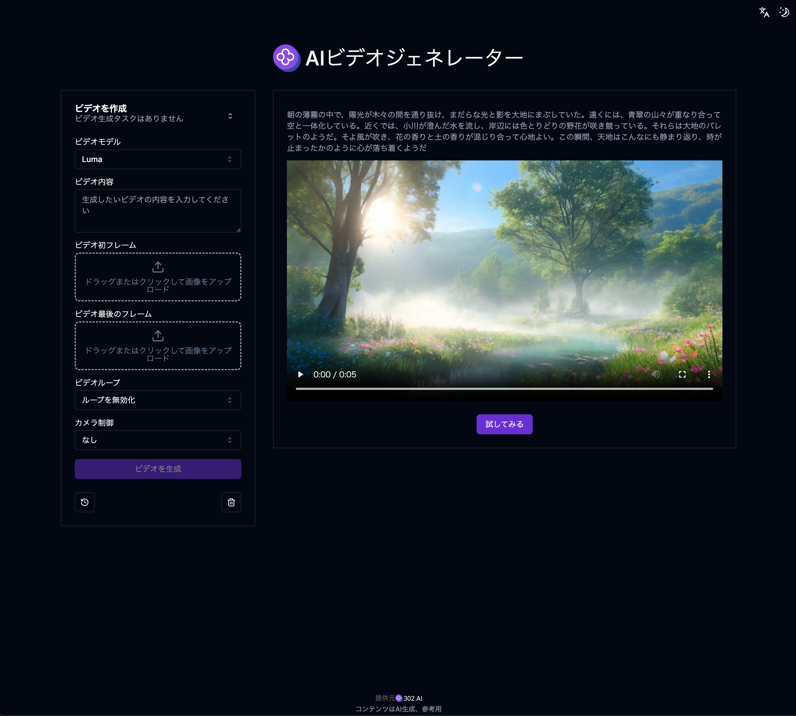

# 🎬🤖 302.AIのAIツールへようこそ! 🚀✨

[中文](README_zh.md) | [English](README.md) | [日本語](README_ja.md)

## ✨ 302.AI紹介 ✨

[302.AI](https://302.ai)は、AIの実践利用のためのラストマイル問題を解決する、従量課金制のAIアプリケーションプラットフォームです。

1. 🧠 最新かつ最も包括的なAI能力とブランドを集約しています。これには、言語モデル、画像モデル、音声モデル、ビデオモデルなどが含まれますが、それらに限られません。
2. 🚀 基礎モデルに基づき、深いアプリケーション開発を行っています。私たちは単なる会話ロボットではなく、真のAI製品を開発しています。
3. 💰 月額料金はゼロです。すべての機能は従量課金制で、全面的に開放されています。本当にハードルが低く、限界は高いです。
4. 🛠 強力な管理バックエンドを持ち、チームや中小企業に向けて、一人で管理し多人数で使用できます。
5. 🔗 すべてのAI能力はAPI接続を提供しています。すべてのツールはオープンソースであり、自由にカスタマイズ可能です（進行中）。
6. 💡 強力な開発チームがあり、毎週2～3個の新しいアプリケーションを発表し、製品は毎日更新されています。参加に興味がある開発者の方もぜひご連絡ください。

## プロジェクト特性

1. 🎥 **AIビデオジェネレーター**: 複数の画像を用いたビデオ生成モデルをサポートし、カスタマイズされたビデオを迅速に生成します。

## 技術スタック

- Next.js 14 基礎フレームワーク
- Tailwind CSS + ShadcnUI スタイルコンポーネント
- Zod + React-Hook-Form フォーム処理
- Zustand データ管理
- React Query 要求管理

## 開発＆デプロイ

1. プロジェクト実行 `pnpm dev`
2. ビルドデプロイ `docker build -t 302-ai-tool . && docker run -p 3000:3000 302-ai-tool`

## インターフェースプレビュー

### 1. AIビデオジェネレーター

