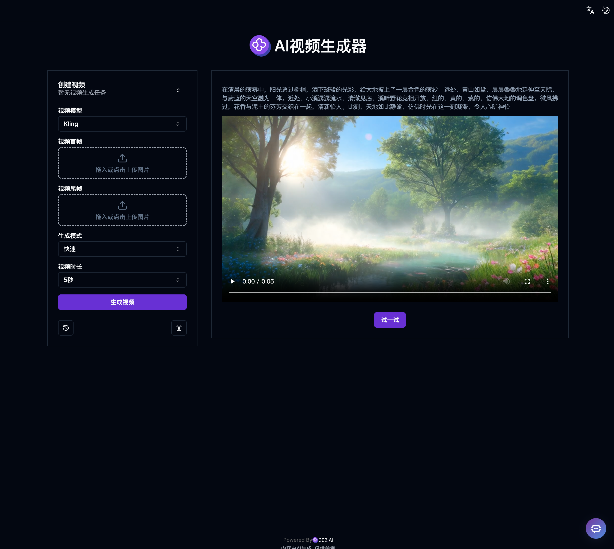

# 🎬🤖 欢迎来到302.AI 的 AI工具! 🚀✨

[中文](README_zh.md) | [English](README.md) | [日本語](README_ja.md)

## ✨ 302.AI介绍 ✨

[302.AI](https://302.ai)是一个按需付费的AI应用平台，为用户解决AI用于实践的最后一公里问题。

1. 🧠 集合了最新最全的AI能力和品牌，包括但不限于语言模型、图像模型、声音模型、视频模型。
2. 🚀 在基础模型上进行深度应用开发，我们开发真正的AI产品，而不是简单的对话机器人。
3. 💰 零月费，所有功能按需付费，全面开放，做到真正的门槛低，上限高。
4. 🛠 功能强大的管理后台，面向团队和中小企业，一人管理，多人使用。
5. 🔗 所有AI能力均提供API接入，所有工具开源可自行定制（进行中）。
6. 💡 强大的开发团队，每周推出2-3个新应用，产品每日更新。有兴趣加入的开发者也欢迎联系我们。

## 项目特性

1. 🎥 **AI视频生成器**: 支持多种图片生成视频模型，快速生成定制视频。

## 技术栈

- Next.js 14 基础框架
- Tailwind CSS + ShadcnUI 样式组件
- Zod + React-Hook-Form 表单处理
- Zustand 数据管理
- React Query 请求管理

## 开发&部署

1. 运行项目 `pnpm dev`
2. 测试部署 `docker build -f Dockerfile.dev -t 302-ai-tool_dev . && docker run -p 3000:3000 302-ai-tool_dev`
3. 正式部署：`docker build -f Dockerfile.prod -t 302-ai-tool_prod . && docker run -p 3000:3000 302-ai-tool_prod`

## 界面预览

### 1. AI视频生成器

